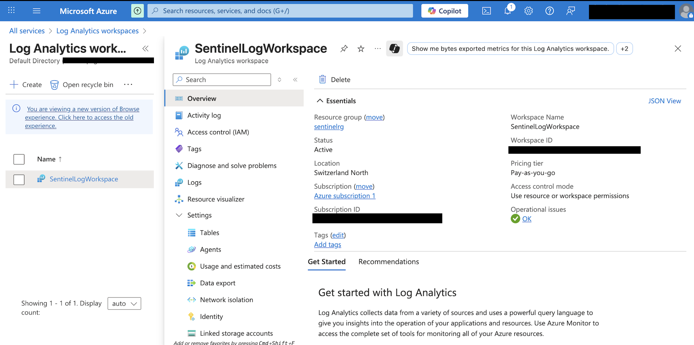
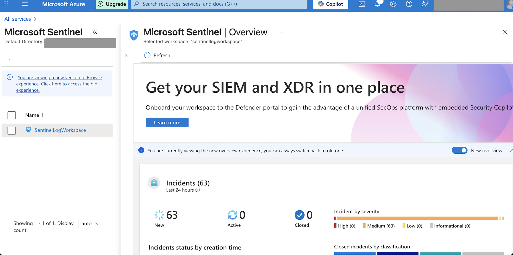
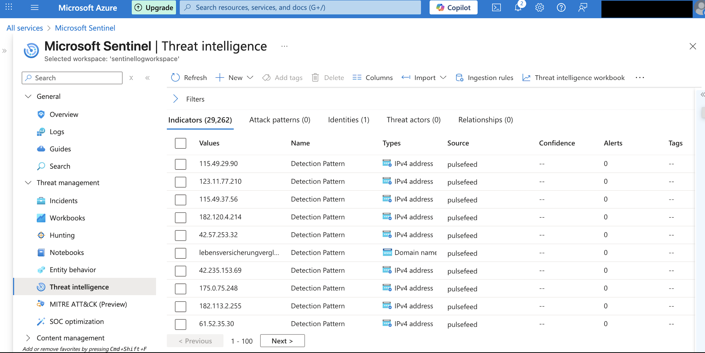
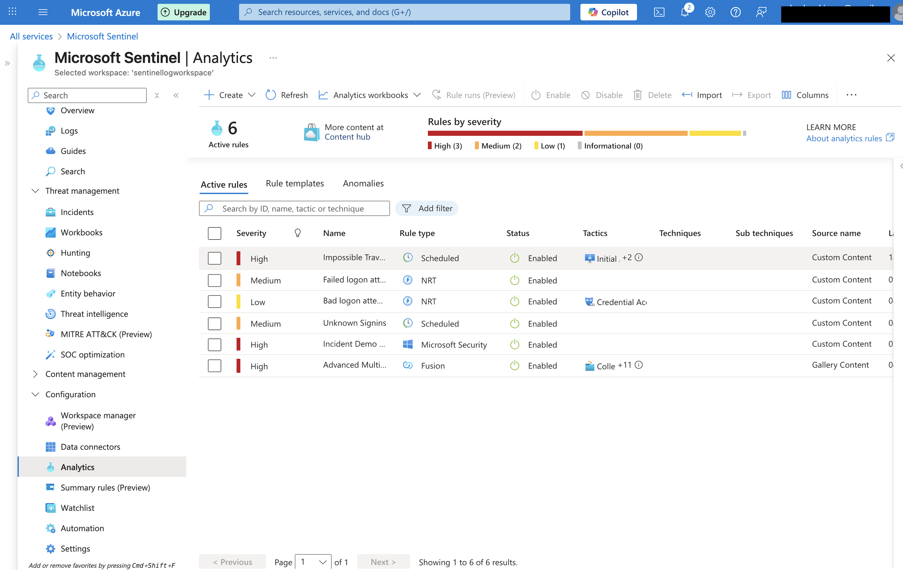
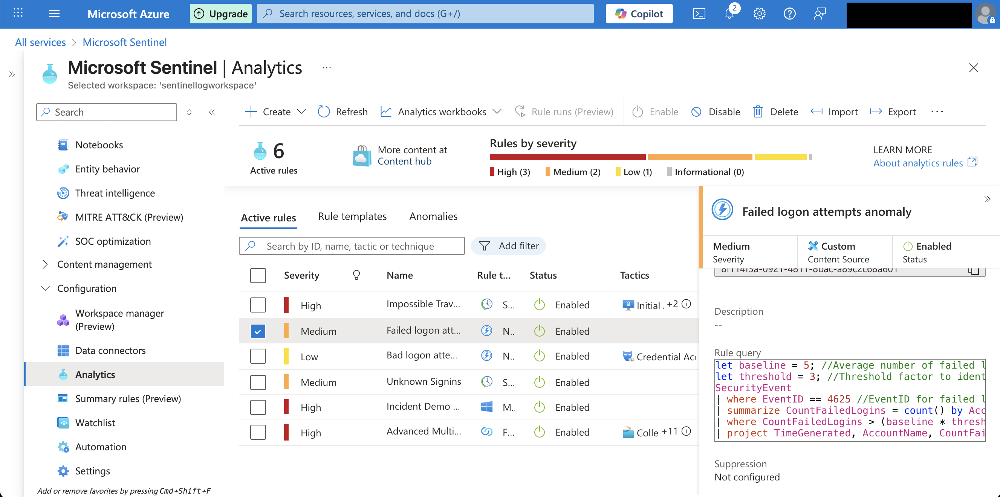
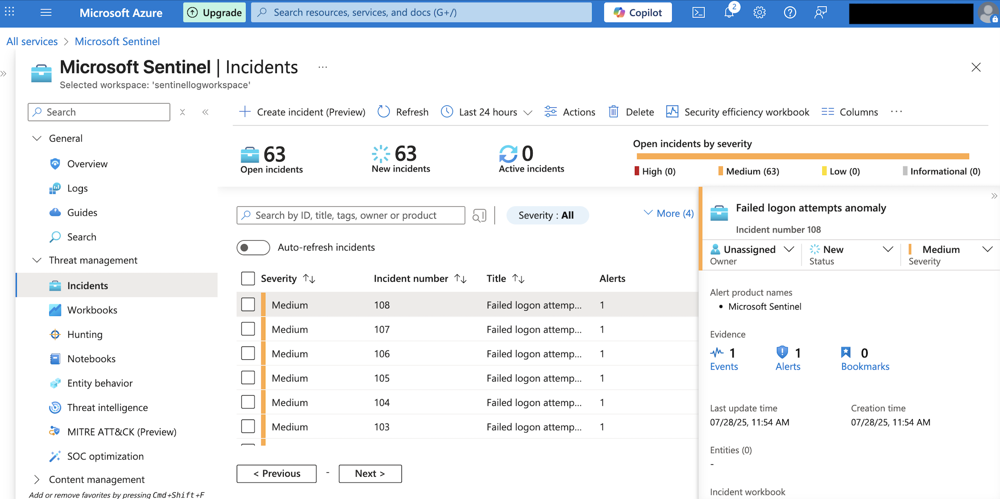
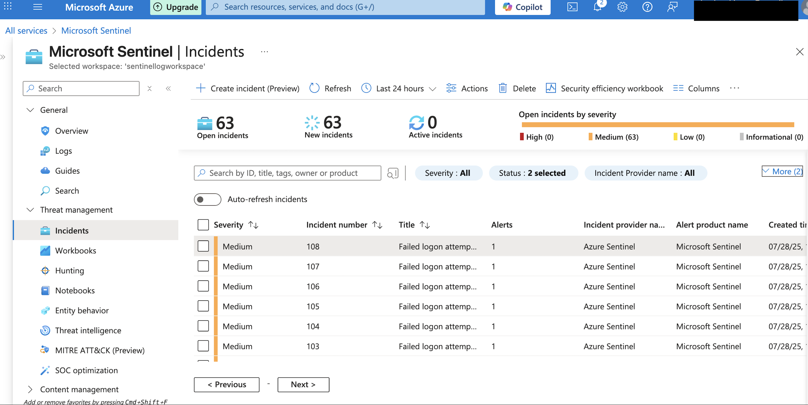

# lab3: Sentinel Configuration, Threat Intelligence, and Incident Investigation

## 🧩 Overview
In this lab, I configured a Log Analytics Workspace, added Microsoft Sentinel, integrated data sources, created analytics rules, and observed how alerts are generated and grouped into incidents.

## ⚙️ Configuration Steps

### 1. Log Analytics Workspace Setup
- Created a workspace: `SentinelLogWorkspace`
- Region: Switzerland North
- Access control: Resource-level (RBAC)
- Connected to Azure Subscription 1

### 2. Added Microsoft Sentinel
- Enabled Microsoft Sentinel on the Log Analytics workspace
- Confirmed that Sentinel is running with no operational issues

### 3. Data Connectors and Threat Intelligence

### Connected Data Sources:
- Azure Virtual Machine
- Connected via **Windows Security Events via AMA**

### Threat Intelligence (TAXII Connector):
- Enabled **Threat Intelligence – TAXII** data connector
- Connected **Pulsedive threat feed**
- Imported ~29,000+ IOCs (IP addresses, domains)
- Source visible in: **Sentinel > Threat Intelligence > Source: pulsefeed**

> Note: TAXII connector allows Microsoft Sentinel to receive real-time threat indicators from trusted open source feeds like Pulsedive.

### 4. 🔔 Alert Rule Configuration

Configured multiple **Analytics rules**, including:
- Failed logon attempts anomaly (NRT)
- Impossible travel detection (scheduled)
- Advanced Multistage Attack Detection (Fusion)

### Analytics Rule: `Failed logon attempts anomaly`
- **Type:** Near Real-Time (NRT)
- ⏱ I used NRT rules to simulate real SOC scenarios and reduce detection delay
- **Severity:** Medium
- **Detection method:** Custom KQL query on `SecurityEvent` (EventID = 4625)
- **Purpose:** Detect brute-force or repeated failed login attempts

## 🚨 Alerting & Incident Investigation
- Alerts triggered by the rules were automatically grouped into incidents in Sentinel.
- All incidents in this case were related to suspicious failed login attempts.
- Investigated incident severity and source within Sentinel > Incidents.
- Demonstrated use of analytics rules and MITRE ATT&CK mapping.

## 🎯 Key Learning Outcomes
- How to configure Sentinel from scratch
- Real-time alert rule creation and tuning
- Incident investigation in a SOC-like environment
- How Sentinel helps monitor, detect, and respond to security threats

## 🖼️ Screenshots
Below are key screenshots demonstrating the configuration, rule creation, threat intelligence integration, and alert investigation process in Microsoft Sentinel.

### 1. Log Analytics Workspace Overview
Shows the configured Log Analytics Workspace (SentinelLogWorkspace) in the Switzerland North region.
### 2. Microsoft Sentinel Enabled
Confirmation that Microsoft Sentinel is enabled on the workspace and running with no operational issues.
### 3. Threat Intelligence Integration
Demonstrates successful ingestion of over 29,000 indicators (IPs/domains) via the TAXII connector from the Pulsedive threat feed.
### 4. Configured Analytics Rules
Displays multiple active rules, including custom NRT, scheduled, and Fusion types. Used to simulate SOC alerting scenarios.
### 5. Alert Rule Query Logic (KQL)
Shows the custom-written KQL query used for detecting anomalous failed logon attempts (EventID 4625), based on dynamic baseline logic.
### 6. Triggered Incidents
Incident list view showing multiple incidents triggered by the analytics rules.
### 7. Incident Details – Failed Logon Attempt
Shows a triggered incident with severity "Medium", generated by the custom rule. Includes incident number, alert product name (Microsoft Sentinel), and related evidence (1 alert, 1 event). No entities were associated.

## 🔒 Skills Demonstrated
- Microsoft Sentinel configuration from scratch
- TAXII Threat Intelligence integration (Pulsedive)
- Creation of custom analytics rules using KQL
- SOC-style alert investigation and incident management
- Understanding of MITRE ATT&CK mapping in Sentinel

